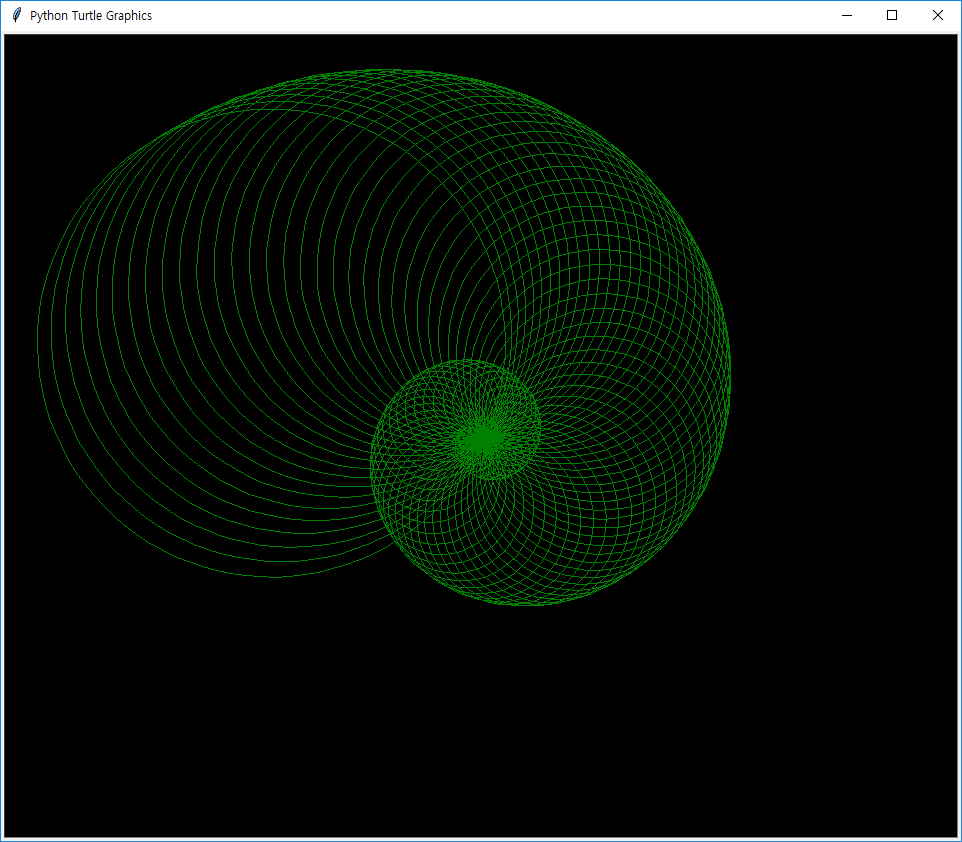
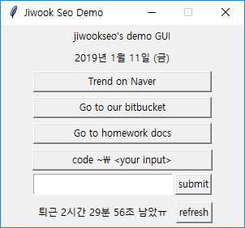
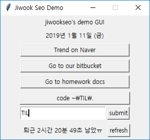

# Python curriculum : week 02 day 5 

2019-01-11 SSAFY

* OOP practice
* Turtle
* Tkinter practice


## I. OOP

> **객체 지향 프로그래밍**(Object-Oriented Programming, OOP)은 [컴퓨터 프 로그래밍](https://ko.wikipedia.org/wiki/%EC%BB%B4%ED%93%A8%ED%84%B0_%ED%94%84%EB%A1%9C%EA%B7%B8%EB%9E%98%EB%B0%8D)의 [패러다임](https://ko.wikipedia.org/wiki/%ED%8C%A8%EB%9F%AC%EB%8B%A4%EC%9E%84)의 하나이다. 객체 지향 프로그래밍은 [컴퓨터 프로그램](https://ko.wikipedia.org/wiki/%EC%BB%B4%ED%93%A8%ED%84%B0_%ED%94%84%EB%A1%9C%EA%B7%B8%EB%9E%A8)을 [명령어](https://ko.wikipedia.org/wiki/%EB%AA%85%EB%A0%B9%EC%96%B4_(%EC%BB%B4%ED%93%A8%ED%8C%85))의 목록으로 보는 시각에서 벗어나 여러 개의 독립된 단위, 즉 "[객체](https://ko.wikipedia.org/wiki/%EA%B0%9D%EC%B2%B4_(%EC%BB%B4%ED%93%A8%ED%84%B0_%EA%B3%BC%ED%95%99))"들의 모임으로 파악하고자 하는 것이다. 각각의 객체는 [메시지](https://ko.wikipedia.org/wiki/%EB%A9%94%EC%8B%9C%EC%A7%80)를 주고받고, [데이터](https://ko.wikipedia.org/wiki/%EB%8D%B0%EC%9D%B4%ED%84%B0)를 처리할 수 있다.

​																				   출처 : 위키백과

### Turtle

> Turtle graphics is a popular way for introducing programming to kids.

​																			       출처 : [Python docs](https://docs.python.org/3.3/library/turtle.html)

아이들에게 프로그래밍을 소개시켜주기 좋은 drawing module이라고 한다..
OOP로 프로그래밍하면 더 쉽게 그림을 그릴 수, 거북이를 움직일 수 있다.

* 실습 source code

    ```python
    import turtle
    class turtleWindow():
        def __init__(self, color="red"):
            self.window = turtle.Screen()
            self.window.bgcolor(color)
            
        def drawTurtle(self, color="yellow"):
            drawObject = turtle.Turtle()
            drawObject.shape("turtle")
            drawObject.color(color)
            return drawObject
        
        def exiton(self):
            self.window.exitonclick()
    
    def regularPolygon(drawObject,n,x):
        for i in range(n):
            if i!=0:
                drawObject.right(180*(1-(n-2)/n))
            drawObject.forward(x)
            
    window=turtleWindow(color="black")
    gbg=window.drawTurtle(color="green")
    n,x=3,5
    while (n<=100):
        regularPolygon(gbg,n,x)
        n+=1
        x+=0.1
        gbg.filling()
    window.exiton()
    ```


* 실행 이미지

    


### Operator overriding

```python
class person():
    def __init__(self, name, age):
        self.name=name
        self.age=age
    def greeting(self):
        print(f"안녕하세요 {self.age}살 {self.name}입니다.")
    def __gt__(self, other):
        return '전자가 웃어른' if self.age > other.age else '후자가 웃어른'
    def __eq__(self, other):
        return '동일인 또는 동명이인' if self.name == other.name else '타인'
    
p1=person("아저씨",40)
p2=person("애기",10)
print(p1<p2)
# output = '후자가 웃어른'

p3=person("애기씨",40)
p4=person("애기씨",10)
print(p3==p4)
print(person.__eq__(p3,p4))
# output = "동일인 또는 동명이인"
#          "동일인 또는 동명이인"
```


### Inheritance and Subclass

```python
class student(person): # person class를 상속받은 subclass student
    def __init__(self,name,age,st_id):
        super(student,self).__init__(name,age) # 부모클래스의 생성자를 가져온다.
        self.st_id=st_id
        
a=student("철우",20,1301035)

a.greeting() # student는 greeting method가 없지만 부모 클래스에 있기에 사용 가능
# output = "안녕하세요 20살 철우입니다."

print(issubclass(student,person))
# output = True
```

```python
class teacher(person):
    def __init__(self,name,age,teachlist):
        super(teacher,self).__init__(name,age)
        self.teachlist=teachlist
    def whatiteach(self):
       	print(f"{self.name} 선생님이 가르치는 수업 목록은 다음과 같다.")
        print("\n".join(self.teachlist))

jk=teacher("john kang",34,["블록체인", "파이썬", "장고"])
jk.whatiteach()
# ----------------------------------------------------------------------------------
# output = john kang 선생님이 가르치는 수업 목록은 다음과 같다.
#		   블록체인
#		   파이썬
# 		   장고
```


### Multiple inheritance

```python
class master_teacher(teacher, person):
	def __init__(self,name,age,teachlist,masterkargs):
		super(master_teacher,self).__init__(name,age,teachlist) # super는 첫번째 부모
        person.__init__(self,name,age,teachlist)				# 두번째 부모는 이렇게..
```


## ​II. Tkinter practice

### Panedwindow()

* 윈도우 내부에 만들 수 있는 내부윈도우
* default로 수직으로 widgets를 배치하는 window와는 다르게 수평으로 widgets를 배치한다.


### Entry()

* Text 입력을 받을 수 있는 창
* Enter 입력과 별도의 버튼을 생성해 submit을 받을 수 있다.
* submit 버튼과 수평으로 배치하기 위해 panedwindow를 함께 사용한다.


### practice

* source code

  ```python
  def mkEtr(root, text, **options):
      def func(event):
          getText=tempEntry.get()
          print(getText)
          code=bashcommand(f"code ..\{getText}\.")
          temp.config(text=f"code ~\{getText}\.", command=code.comm)
      def onclick(event=None):
          getText=tempEntry.get()
          print(getText)
          code=bashcommand(f"code ..\{getText}\.")
          temp.config(text=f"code ~\{getText}\.", command=code.comm)
      
      etrPaned=PanedWindow(orient="vertical")
      etrPaned2=PanedWindow()
      
      temp=mkBtn(etrPaned, text=text, command=None, width=25)
      tempEntry = Entry(etrPaned2,**options)
      root.bind('<Return>',func)
      
      etrPaned.add(temp)
      etrPaned2.add(tempEntry)
      etrPaned2.add(mkBtn(etrPaned2,"submit",onclick,width=5))
      etrPaned.add(etrPaned2)
      return etrPaned
  ```


* 실행이미지

   

  * 기본 실행 화면, Entry와 submit Button / TIL 입력 후 상단 버튼의 text와 command가 변경된다.