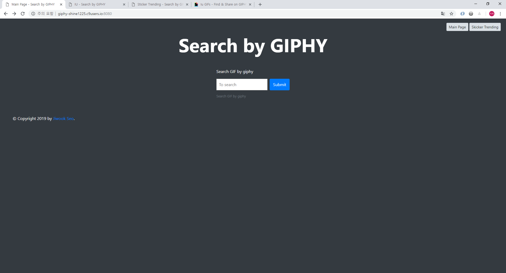
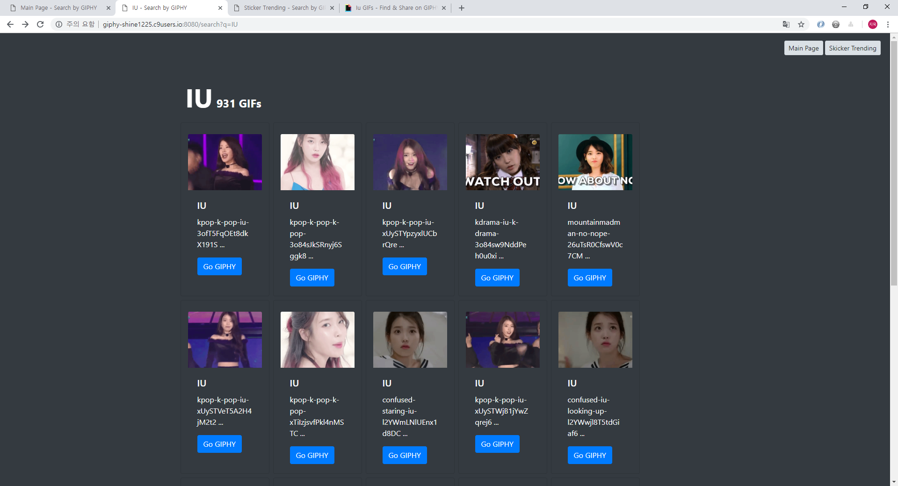
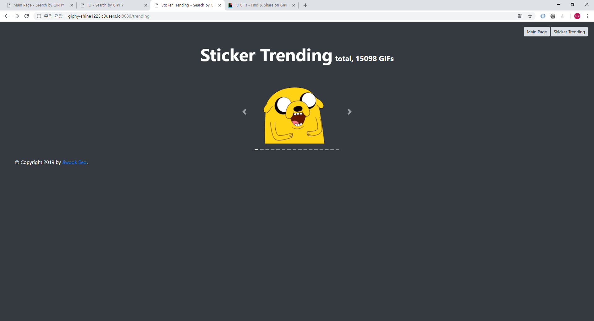

# Python curriculum : week 03 day 4

2019-01-17 SSAFY 

* css, html
* selector
* bootstrap practice

## I. Bootstrap practice

[source code github repository](https://github.com/jiwookseo/giphy)

### GIF search by GIPHY API

giphy에서 제공하는 api를 이용한 GIF 검색, 스티커 트랜드를 알려주는 Flask Web 서비스

### 구성
* app.py
  giphy api에 request를 보내 respond 받은 json을 가공해준다.

* layout.html
  중복되는 bootstrap code를 layout.html에 jinja block syntax를 이용해 구조 html를 작성하였다.

* index.html
  사용자로부터 검색할 Keyword를 받아와 action으로 search에 리디렉션 해준다.

  

* search.html

  gif를 가공해 4*5 card 형태로 GIF 이미지와 slug를 출력해주고, 해당 GIPHY link에 연결할 수 있도록 한다.
  

  

* trending.html
  giphy trending api를 이용해 sticker trending 을 가져와 16개를 carousel로 슬라이드하여 보여준다.

  

  

  

  